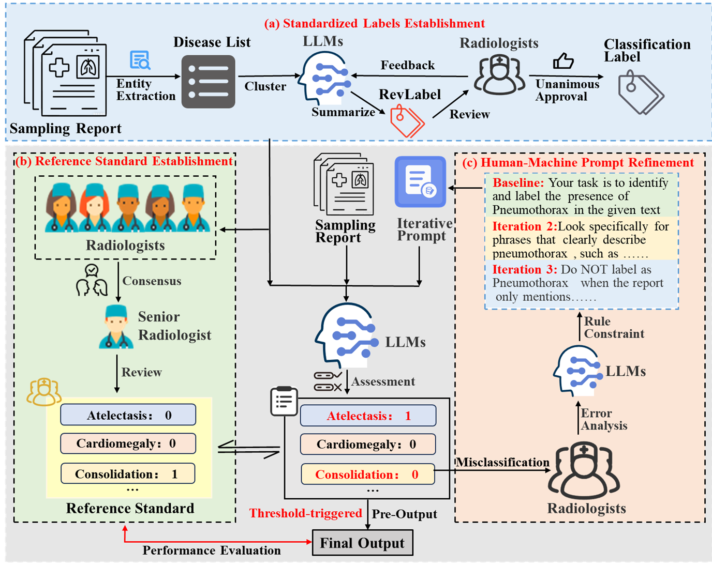

#  Ran-Score

[](https://doi.org/10.5281/zenodo.18489808)

This repository contains the RanScore dataset for evaluating radiology report generation.
__《Ran Score: a LLM-based Evaluation Score for Radiology Report Generation》__  
# Introduction： 
Rising workloads and substantial inter-reader variability increasingly complicate manual interpretation of chest X-ray reports. Although large language models have shown promise for report analysis, their clinical reliability remains limited by missed low-prevalence pathologies and misinterpretation of diagnostic language. We introduce a Human–LLM cooperation framework for automated multi-label pathology extraction from free-text chest X-ray reports. The framework uses iterative, clinician-guided prompt refinement. This process is driven by systematic analysis of model failure modes and encodes clinical diagnostic reasoning in a transparent and reproducible manner without model retraining. Evaluated against a reference standard established by majority vote among six thoracic radiologists, the framework achieved radiologist-level performance on a total of 3,000 English reports and demonstrated robust generalization to 150 Chinese reports. Overall performance reached a macro-averaged F1 score of 0.956, with accuracy exceeding 95% for most pathology categories and complete recall of rare findings. This improvement reflects targeted mitigation of class imbalance and negation-related errors rather than reliance on model scaling or memorization. This approach outperformed conventional prompting strategies and existing automated labelers, while maintaining stable performance across languages. By aligning large language models with expert diagnostic reasoning through clinician-in-the-loop refinement, this framework provides a practical pathway to reduce interpretive variability and improve diagnostic reliability. It supports routine chest X-ray interpretation in real-world clinical settings. To promote reproducibility, the entire MIMIC-CXR dataset, along with the complete prompt set and evaluation code, is publicly released upon publication, enabling transparent and extensible evaluation of radiology-oriented language models. 
## Feature:
1.Supports prediction of over 21 types of chest disease tags, such as atelectasis, cardiomegaly, pneumonia, etc.  
2.Includes features for resuming from breakpoints and automatic error logging.  
3.Outputs results in CSV format 
  
## Framework


#  Getting Started:  
## Installation
### 1. Prepare the code and the environment
    cd Ran-Score
    pip install -r requirements.txt
### 2. Prepare the training dataset
We use the [MIMIC-CXR dataset](https://physionet.org/content/mimic-cxr/2.1.0/).To handle Chinese reports, add encoding='gbk' when specifying the input report path.After downloading the data, place it in the ./data folder.
You can prepare medical report data in CSV format.  
The file should include the following fields:  
  study_id: Study identifier  
  id: Case ID  
  report: Imaging report text  
## Model Deployment
We deploy the Qwen3-14B model using the vLLM OpenAI-compatible API server.
Start the inference server with the following command:
```bash
CUDA_VISIBLE_DEVICES=1,2 python -m vllm.entrypoints.openai.api_server \
  --model /mnt/Qwen3-14B \
  --host 0.0.0.0 \
  --port 8000 \
  --dtype half \
  --tensor-parallel-size 2
#### Example input Structure:  
```csv
study_id,id,report
1001,1,"PA view shows right middle lobe consolidation..."
```

## Configuration Instructions:  
Modify the parameters of the model_predict() function:  
```python
response = client.chat.completions.create(
model="/mnt/Qwen3-14B",
messages=[{'role': 'system', 'content': 'You are a radiologist analyzing medical reports.'},
          {'role': 'user', 'content': prompt}],
            temperature=0.0,
            top_p=1.0,
            max_tokens=50,
            seed=42)
```

## Output Results：  
The output file qwen.csv includes:  
  Original report identifier  
  Model response in JSON format  
  Prediction results for each pathological label (0/1)  
### Example:  
```csv
study_id,id,content,Atelectasis,Cardiomegaly,...
1001,1,"{'Atelectasis': '0',...}",0,1,...,0
```

# Acknowledgements  
  MIMIC-CXR dataset   
  OpenAI Python client library  
  

# Frequently Asked Questions  
Q: Model loading failed?
A: Make sure the vLLM server is running and the Qwen3-14B model path is correct. 
You can start the server with:
```bash
CUDA_VISIBLE_DEVICES=1,2 python -m vllm.entrypoints.openai.api_server \
  --model /mnt/Qwen3-14B \
  --port 8000 \
  --dtype half \
  --tensor-parallel-size 2
Q: Slow processing speed?  
A: Try the following methods:  
Use a smaller model.  
Increase the timeout parameter.  
Process data in batches.  
Q: How to customize tags?  
A: Modify the detection rules in the prompt_templates dictionary.  
